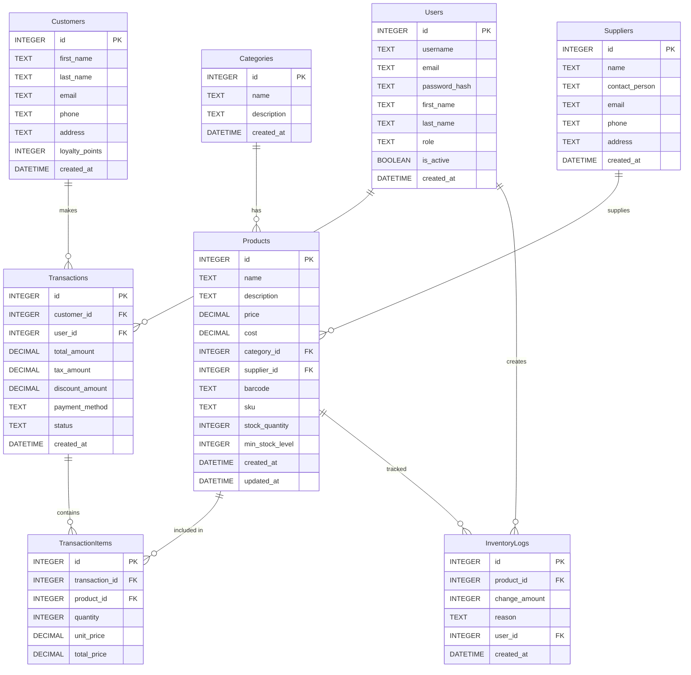

# Database Design

## Entities and Relationships

### 1. Products
- id (INTEGER, PRIMARY KEY)
- name (TEXT, NOT NULL)
- description (TEXT)
- price (DECIMAL, NOT NULL)
- cost (DECIMAL)
- category_id (INTEGER, FOREIGN KEY)
- supplier_id (INTEGER, FOREIGN KEY)
- barcode (TEXT, UNIQUE)
- sku (TEXT, UNIQUE)
- stock_quantity (INTEGER, DEFAULT 0)
- min_stock_level (INTEGER, DEFAULT 0)
- created_at (DATETIME, DEFAULT CURRENT_TIMESTAMP)
- updated_at (DATETIME, DEFAULT CURRENT_TIMESTAMP)

### 2. Categories
- id (INTEGER, PRIMARY KEY)
- name (TEXT, NOT NULL)
- description (TEXT)
- created_at (DATETIME, DEFAULT CURRENT_TIMESTAMP)

### 3. Suppliers
- id (INTEGER, PRIMARY KEY)
- name (TEXT, NOT NULL)
- contact_person (TEXT)
- email (TEXT)
- phone (TEXT)
- address (TEXT)
- created_at (DATETIME, DEFAULT CURRENT_TIMESTAMP)

### 4. Customers
- id (INTEGER, PRIMARY KEY)
- first_name (TEXT, NOT NULL)
- last_name (TEXT, NOT NULL)
- email (TEXT)
- phone (TEXT)
- address (TEXT)
- loyalty_points (INTEGER, DEFAULT 0)
- created_at (DATETIME, DEFAULT CURRENT_TIMESTAMP)

### 5. Transactions
- id (INTEGER, PRIMARY KEY)
- customer_id (INTEGER, FOREIGN KEY)
- user_id (INTEGER, FOREIGN KEY)
- total_amount (DECIMAL, NOT NULL)
- tax_amount (DECIMAL, DEFAULT 0)
- discount_amount (DECIMAL, DEFAULT 0)
- payment_method (TEXT)
- status (TEXT, DEFAULT 'completed')
- created_at (DATETIME, DEFAULT CURRENT_TIMESTAMP)

### 6. TransactionItems
- id (INTEGER, PRIMARY KEY)
- transaction_id (INTEGER, FOREIGN KEY)
- product_id (INTEGER, FOREIGN KEY)
- quantity (INTEGER, NOT NULL)
- unit_price (DECIMAL, NOT NULL)
- total_price (DECIMAL, NOT NULL)

### 7. InventoryLogs
- id (INTEGER, PRIMARY KEY)
- product_id (INTEGER, FOREIGN KEY)
- change_amount (INTEGER, NOT NULL)
- reason (TEXT)
- user_id (INTEGER, FOREIGN KEY)
- created_at (DATETIME, DEFAULT CURRENT_TIMESTAMP)

### 8. Users
- id (INTEGER, PRIMARY KEY)
- username (TEXT, UNIQUE, NOT NULL)
- email (TEXT, UNIQUE)
- password_hash (TEXT, NOT NULL)
- first_name (TEXT)
- last_name (TEXT)
- role (TEXT, DEFAULT 'cashier')
- is_active (BOOLEAN, DEFAULT TRUE)
- created_at (DATETIME, DEFAULT CURRENT_TIMESTAMP)

## Relationships
- Products belong to one Category (many-to-one)
- Products have one Supplier (many-to-one)
- Transactions belong to one Customer (many-to-one)
- Transactions belong to one User (many-to-one)
- Transactions have many TransactionItems (one-to-many)
- TransactionItems belong to one Product (many-to-one)
- InventoryLogs belong to one Product (many-to-one)
- InventoryLogs are created by one User (many-to-one)

## Indexes
- Products: barcode, sku, name
- Categories: name
- Suppliers: name
- Customers: email, phone
- Transactions: created_at, status
- Users: username, email

## Entity Relationship Diagram

