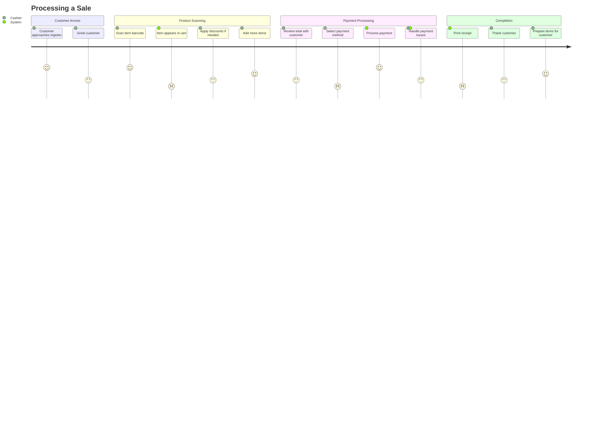
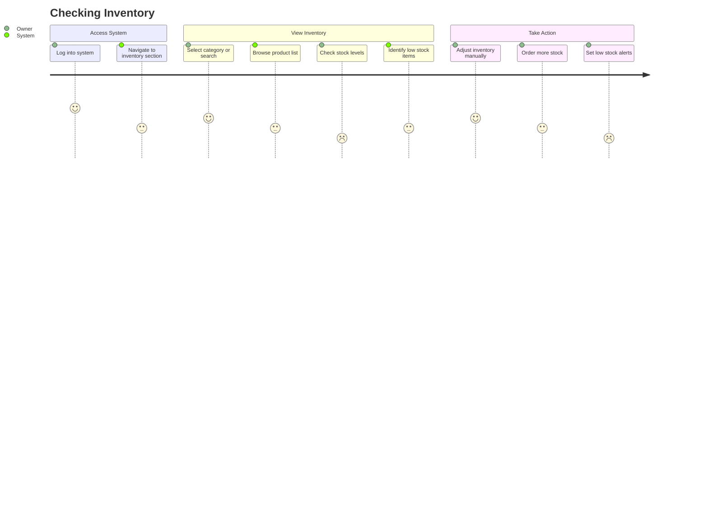
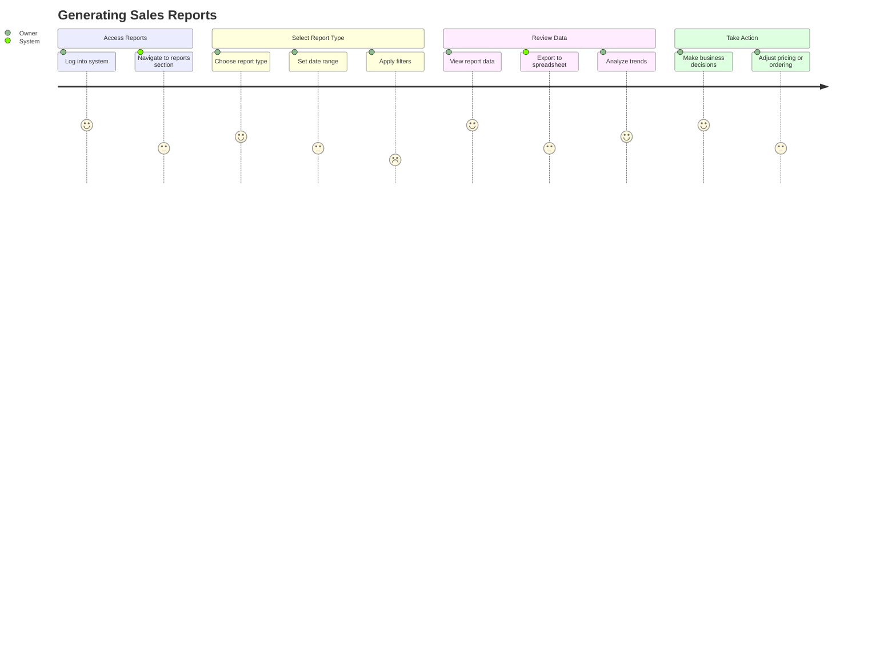
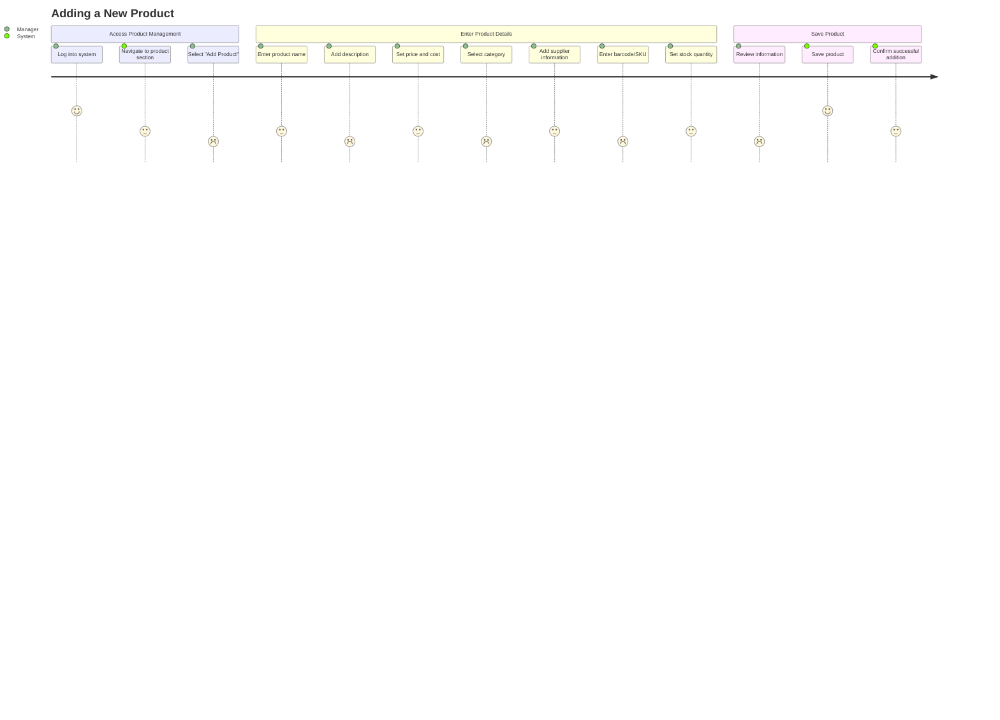
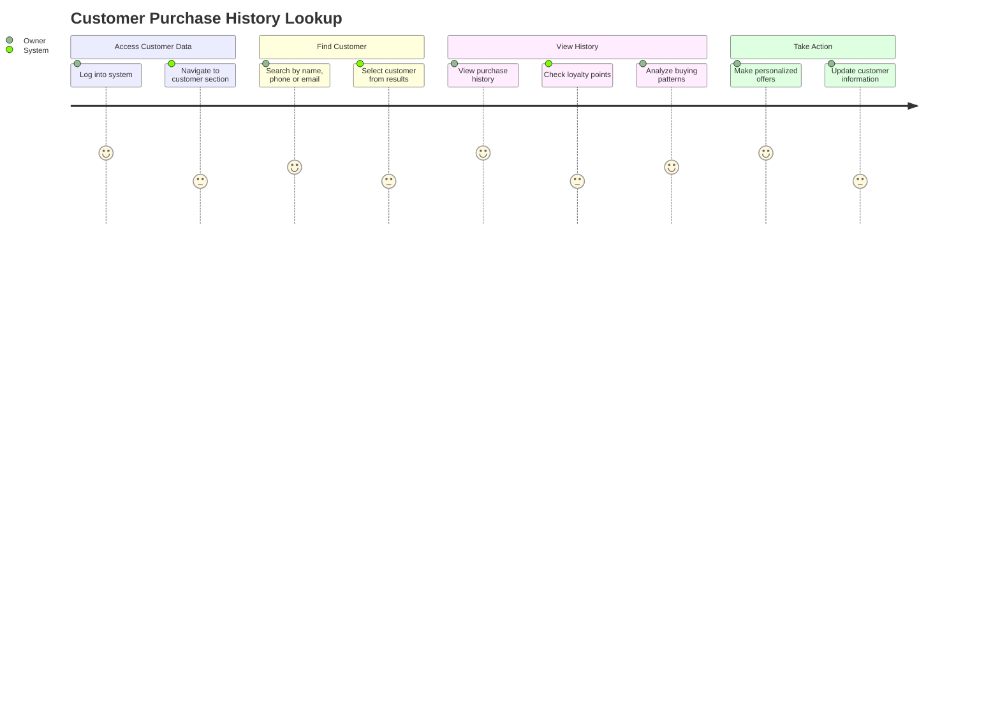
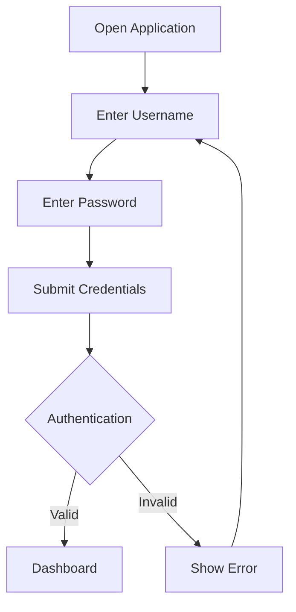
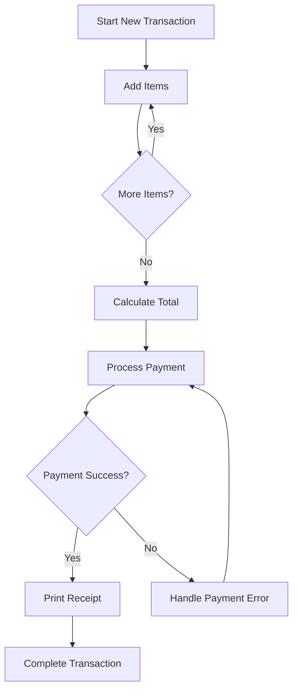
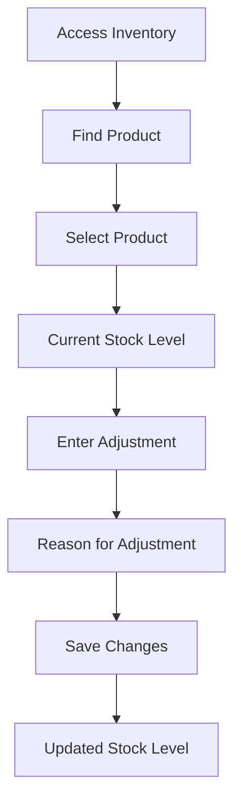

# User Flows and Journey Maps

## Primary User Journeys

### 1. Processing a Sale (Cashier)



### 2. Checking Inventory (Store Owner/Manager)



### 3. Generating Sales Reports (Store Owner)



### 4. Adding a New Product (Store Manager)



### 5. Customer Purchase History Lookup (Store Owner)



## Key User Flows

### Login Flow



### POS Transaction Flow



### Inventory Adjustment Flow



### Report Generation Flow

```mermaid
flowchart TD
    A[Access Reports] --> B[Select Report Type]
    B --> C[Set Parameters]
    C --> D[Generate Report]
    D --> E{Report Ready?}
    E -->|Yes| F[View Report]
    E -->|No| D
    F --> G{Export Needed?}
    G -->|Yes| H[Export Options]
    G -->|No| I[View Only]
    H --> J[Export Report]