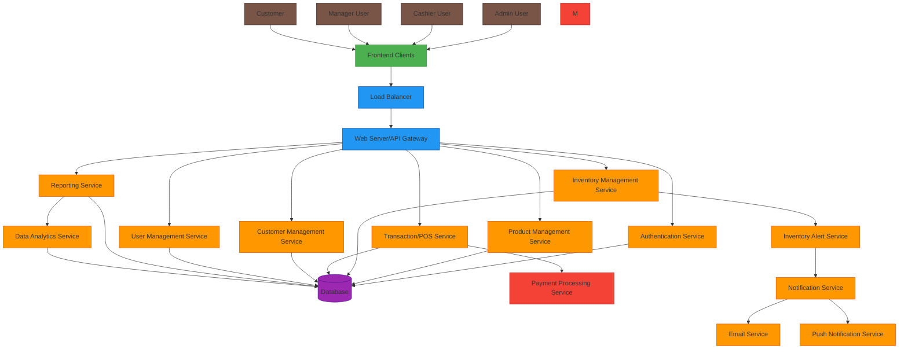

# System Architecture Diagram

## Overall System Design

## Component Descriptions

### Frontend Clients
- **Web Application**: Main interface for users (desktop and mobile browsers)
- **Mobile Application**: Native mobile app for on-the-go access
- **POS Terminal**: Dedicated hardware/software for checkout operations

### Infrastructure Layer
- **Load Balancer**: Distributes incoming requests across multiple servers
- **Web Server/API Gateway**: Entry point for all API requests, handles routing and initial processing

### Core Services
- **Authentication Service**: Handles user login, logout, and session management
- **Product Management Service**: CRUD operations for products, categories, and suppliers
- **Inventory Management Service**: Tracks stock levels, manages inventory adjustments
- **Transaction/POS Service**: Processes sales transactions, handles payment processing
- **Customer Management Service**: Manages customer information and loyalty programs
- **User Management Service**: Handles user accounts, roles, and permissions
- **Reporting Service**: Generates sales reports, inventory reports, and analytics

### Data Layer
- **Database**: Central PostgreSQL database storing all application data

### External Services
- **Inventory Alert Service**: Monitors stock levels and triggers alerts when items are low
- **Notification Service**: Sends notifications via email or push notifications
- **Data Analytics Service**: Processes data for advanced reporting and insights

### User Roles
- **Admin User**: Full system access, manages all aspects of the system
- **Manager User**: Manages products, inventory, and reports
- **Cashier User**: Processes sales transactions
- **Customer**: Makes purchases (represented in the system through transactions)

## Data Flow

1. Users access the system through frontend clients
2. Requests are routed through the load balancer to the web server
3. The web server directs requests to appropriate microservices
4. Services interact with the database to retrieve or store data
5. External services are called when needed (payments, notifications)
6. Responses are sent back to the user through the same path

## Technology Stack

### Frontend
- Next.js with TypeScript
- ShadCN/Tailwind for UI components
- Zustand for state management

### Backend
- NestJS with TypeScript
- PostgreSQL database
- RESTful API architecture

### Infrastructure
- Docker for containerization
- Kubernetes for orchestration (planned)
- NGINX for load balancing
- Redis for caching (planned)

### External Services
- Stripe/PayPal for payment processing
- SendGrid for email notifications
- Firebase for push notifications (planned)

## Scalability Considerations

1. **Horizontal Scaling**: Services can be scaled independently based on demand
2. **Database Optimization**: Proper indexing and query optimization
3. **Caching**: Redis caching for frequently accessed data
4. **CDN**: Content delivery network for static assets
5. **Microservices**: Independent deployment and scaling of services

## Security Measures

1. **Authentication**: JWT-based authentication with secure token handling
2. **Authorization**: Role-based access control
3. **Data Encryption**: Sensitive data encryption at rest and in transit
4. **Input Validation**: Comprehensive input validation and sanitization
5. **Rate Limiting**: API rate limiting to prevent abuse
6. **Audit Logs**: Comprehensive logging for security monitoring